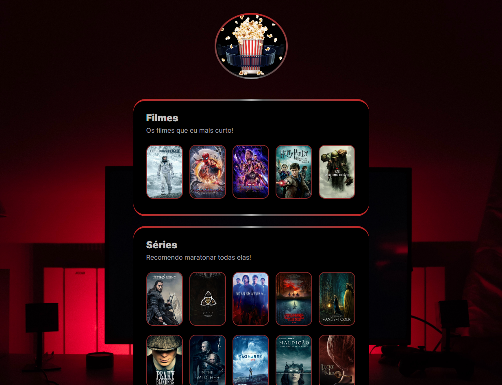

<h1 align="center">
   NLW-Esports - Trilha Explorer
</h1>

## :man_artist: Autor

[kaduej](https://github.com/kaduej) :wave:

## :man_teacher: Professor

- **[@Mayk Brito](https://github.com/maykbrito)**

- **[Rockeseat NLW ](https://rseat.in/nlw-edicao-esports)**

## :computer: Descrição
Nesse projeto utilizei:

:point_right: HTML

:point_right: CSS 
<h2 align="center">
  🚀 Prévia do layout do projeto
</h2>

  

###### :pushpin: Você pode acessa-lo através desse <a href='https://kaduej.github.io/NLW-Challenge/'>Link!</a>
###### :pushpin: Você pode acessar o projeto original no Figma através desse <a href='https://www.figma.com/file/x0V3FyaVbK8OA1UBz44wmX/NLW-eSports-(Community)?node-id=79%3A2502'>Link!</a>
